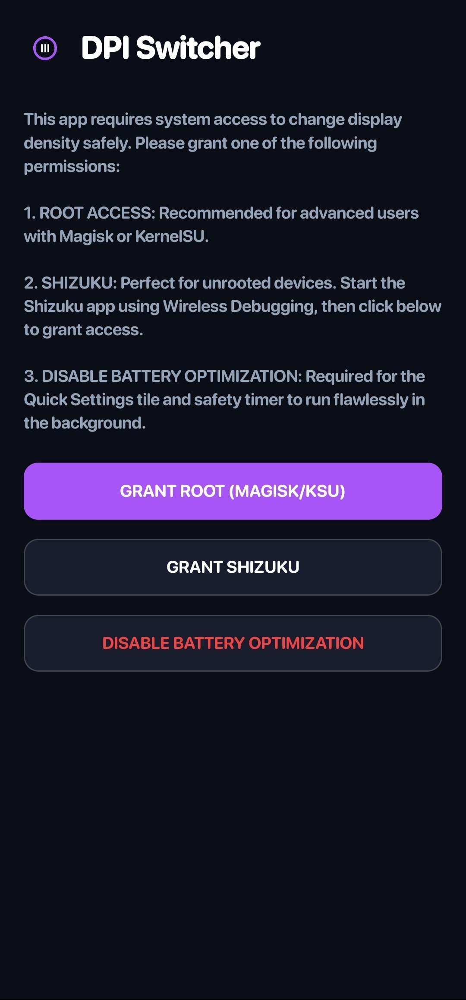
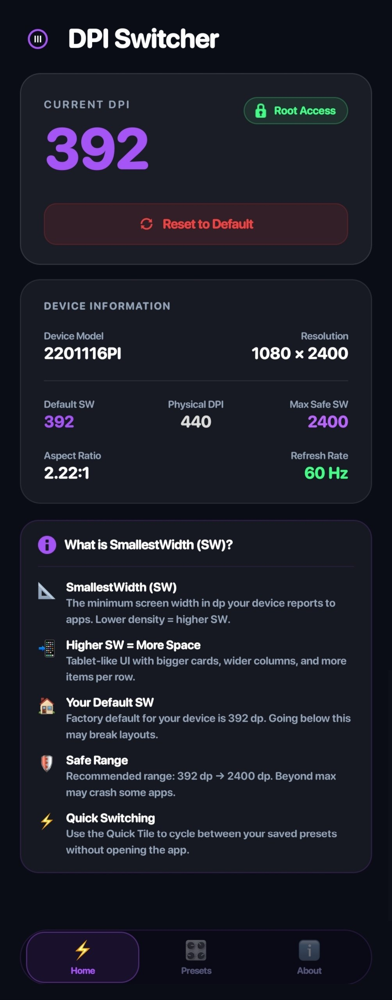
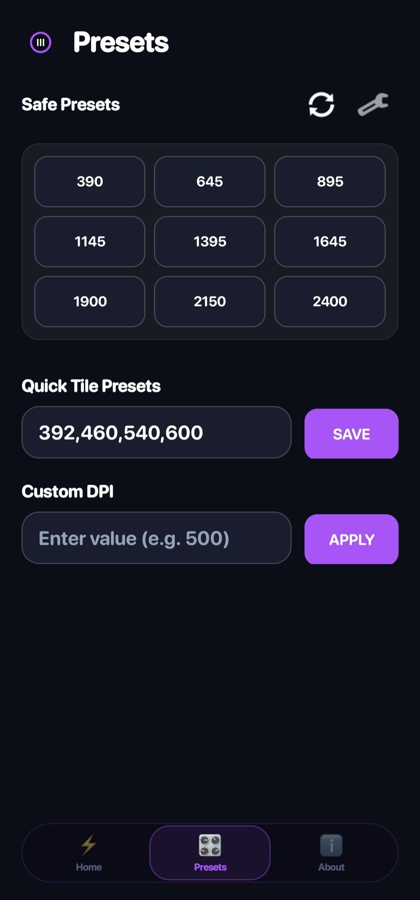
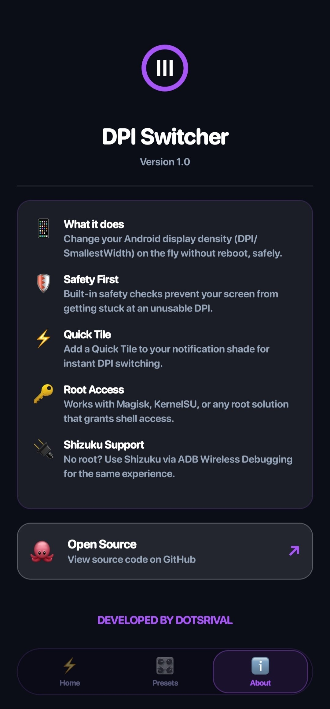

# 🖥️ DPI Switcher — For All Devices

<p align="center">
  
  
  
  
  
</p>

<p align="center">
  Change your Android display density (SW / SmallestWidth) on the fly — no reboot needed.<br/>
  Built with a premium dark UI, Quick Tile support, and safety-first design.
</p>

---

## 📸 Screenshots

<p align="center">
  
  &nbsp;&nbsp;
  
  &nbsp;&nbsp;
  
  &nbsp;&nbsp;
  
</p>

---

## ✨ Features

| Feature | Description |
|---------|-------------|
| ⚡ **Instant DPI Change** | Apply any SmallestWidth value without rebooting |
| 🎛️ **Presets System** | Save and switch between your favorite DPI presets |
| 🔔 **Quick Tile** | Add a tile to your notification shade for instant switching |
| 🛡️ **Safety Checks** | Built-in validation prevents unusable DPI values |
| 🔑 **Root Support** | Works with Magisk, KernelSU, and any root solution |
| 🔌 **Shizuku Support** | No root? Use Shizuku via ADB Wireless Debugging |
| 💜 **Premium Dark UI** | Glassmorphism design with purple accent — no XML layouts |
| 📱 **Tablet-Like UI** | Higher SW = more content, wider layouts, better use of screen space |

---

## 🚀 Getting Started

### Requirements
- Android 9+ (API 28+)
- **Root** (Magisk / KernelSU) **OR** **Shizuku** (ADB Wireless Debugging)
- Works on most Android devices

### Installation
1. Download the latest APK from [Releases](https://github.com/uniqueappsorg/DPI-SWITCHER/releases)
2. Install the APK
3. Open the app and grant Root or Shizuku permission
4. Set your desired SmallestWidth value and tap **Apply**

---

## 🔧 How It Works

DPI Switcher changes the `smallest_width` configuration on your device using:

```bash
# Root / Shizuku
wm density <value>
```

The app saves your **physical density** at first launch so it can always revert to the original value safely.

---

## 📐 Understanding SmallestWidth (SW)

| SW Value | Effect |
|----------|--------|
| **Lower than default** | Larger UI elements, easier to read |
| **Default (e.g. 393dp)** | Factory standard for your device |
| **Higher than default** | More content fits on screen, tablet-like layouts |
| **Too high (> max safe)** | May crash some apps — use with caution |

> 💡 **Tip:** Most Android devices have a default SW around 360–410dp. Safe max is typically 480–600dp.

---

## 🛡️ Safety System

- **Minimum guard** — Will not apply values below your physical screen limits
- **Maximum safe SW** — Calculated from your screen resolution and density
- **Safety dialog** — 10-second countdown before applying risky values
- **Auto-revert** — Tile service can restore original DPI from Quick Settings
- **In-app notifications** — Custom overlay toasts immune to DPI changes

---

## 🧩 Quick Tile Setup

1. Pull down your notification shade
2. Tap **Edit tiles** (pencil icon)
3. Find **DPI Switcher** and drag it to your active tiles
4. Tap the tile to cycle through your saved presets

---

## 🏗️ Build From Source

```bash
# Clone the repo
git clone https://github.com/uniqueappsorg/DPI-SWITCHER.git
cd DPI-SWITCHER

# Build debug APK
./gradlew assembleDebug

# APK output → app/build/outputs/apk/debug/app-debug.apk
```

### Dependencies
- [Shizuku](https://github.com/RikkaApps/Shizuku) — `api.rikka.shizuku`
- AndroidX SwipeRefreshLayout

---

## 📁 Project Structure

```
DPISwitcher/
├── app/src/main/java/com/dpitile/switcher/
│   ├── MainActivity.java        # Main UI — all tabs, home, presets, about
│   ├── DpiController.java       # Core DPI logic, device info detection
│   ├── DpiTileService.java      # Quick Settings tile service
│   ├── RootManager.java         # Shell command execution (Root/Shizuku)
│   ├── StateManager.java        # SharedPreferences — presets, DPI state
│   ├── SplashActivity.java      # Launch screen
│   ├── TileHelper.java          # Quick tile utilities
│   └── TileLaunchActivity.java  # Tile tap handler activity
└── app/src/main/res/
    ├── drawable/                # App icons, button styles
    └── values/                  # Colors, strings, themes
```

---

## 🤝 Contributing

Pull requests are welcome! For major changes, please open an issue first.

1. Fork the repo
2. Create your feature branch (`git checkout -b feature/AmazingFeature`)
3. Commit your changes
4. Push to the branch
5. Open a Pull Request

---

## 📄 License

Distributed under the MIT License.

---

## 👤 Developer

**Unique Apps**

[](https://github.com/uniqueappsorg)

---

<p align="center">Made with 💜 for the Android community by <strong>Unique Apps</strong></p>
